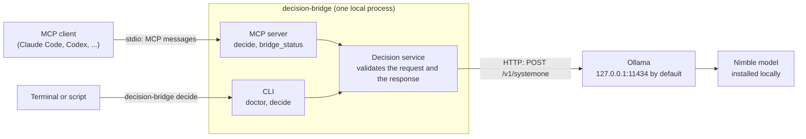

# Decision Bridge

A small MCP server and CLI that lets any stdio MCP client ask a local Nimble model, running through Ollama, for typed decisions.

> Status: pre-release (0.1.0). Not published to any package registry.

## What it does

You supply the evidence and the allowed answers. Decision Bridge validates the request, sends it to Ollama's dedicated Nimble decision endpoint (`POST /v1/systemone`), validates the response against your questions, and returns typed results. Your calling application decides what, if anything, to do next.



The MCP client starts `decision-bridge serve`; Ollama's API address is **not** an MCP server URL.

Two MCP tools are exposed: `decide` and `bridge_status`. The same decision logic is available from the command line (`decision-bridge decide`). Three question types are supported: `choice` (pick one labelled alternative), `noul` (returns a probability, not a boolean), and `score` (rate against an ordered rubric). Details: [docs/tool-contract.md](docs/tool-contract.md).

Decision Bridge is not an agent, a chat interface, or a classifier for one specific workflow. It does not download models, manage Ollama, or execute the decisions it returns.

## Prerequisites

- **Ollama 0.35 or newer**, running: <https://ollama.com/download>. Nimble decisions need that version. See the [model page](https://ollama.com/library/nimble:latest) for the current contract.
- **The Nimble model, installed explicitly by you.** The download is roughly 9.5 GB (see the model page); disk size is not a RAM requirement or a speed guarantee, and this project makes no universal minimum-memory claim. Whether your machine runs it comfortably depends on your hardware.
- **Python 3.11 or newer** and [`uv`](https://docs.astral.sh/uv/getting-started/installation/) (recommended). A pip alternative is in [docs/installation.md](docs/installation.md).
- An MCP client that can launch a stdio server (only needed for MCP use; the CLI works without one).

The bridge itself needs no GPU libraries, model weights, Node.js, database, or Docker.

## Quickstart (from a source download)

Works today, before any registry release.

1. Install Ollama and make sure its server is running (the desktop app usually runs it; use `ollama serve` only if nothing is listening on port 11434).
2. Download the model yourself:

   ```sh
   ollama pull nimble:latest
   ```

3. Get this repository: [download the ZIP](https://github.com/poacosta/decision-bridge-nimble-mcp/archive/refs/heads/main.zip) and extract it (no Git needed), or clone it:

   ```sh
   git clone https://github.com/poacosta/decision-bridge-nimble-mcp.git
   cd decision-bridge-nimble-mcp
   ```
4. In the project directory:

   ```sh
   uv tool install .
   decision-bridge doctor
   decision-bridge doctor --smoke-test
   decision-bridge decide --input examples/task-routing.json
   ```

   `doctor` checks configuration, Ollama, and the installed model without running inference. `doctor --smoke-test` sends one tiny synthetic request and may load the model, so a cold start can take a while.

5. Connect your MCP client: [docs/clients.md](docs/clients.md).
6. Ask your agent to try it:

   > Use Decision Bridge to classify the supplied request into one of the provided categories. Return the selected category and probabilities. Do not execute the selected action.

Other install routes (development checkout, local wheel, pip, Windows notes): [docs/installation.md](docs/installation.md). A step-by-step guide to installing, connecting, and using it from an agent or the command line: [docs/usage.md](docs/usage.md).

## Example

Input, [`examples/mixed-questions.json`](examples/mixed-questions.json):

```json
{
  "state": {
    "request": "Investigate a payment failure reported by a customer."
  },
  "questions": {
    "route": {
      "type": "choice",
      "instructions": "Select the most appropriate handling category.",
      "criteria": {
        "routine": "A known mechanical task with no behavior change.",
        "investigate": "A problem requiring investigation.",
        "unknown": "The evidence is insufficient to choose."
      }
    },
    "mentions_payment": {
      "type": "noul",
      "instructions": "Does the request explicitly mention a payment problem?"
    },
    "evidence_detail": {
      "type": "score",
      "instructions": "Rate the amount of diagnostic detail provided.",
      "criteria": [
        "A general report without reproduction details.",
        "Some concrete diagnostic details.",
        "Clear reproduction steps and supporting evidence."
      ]
    }
  }
}
```

Output from a real run of `decision-bridge decide --input examples/mixed-questions.json` on 2026-09-30 (macOS, Ollama 0.35.0, `nimble:latest` digest `24e550a16a70`). Values come from the model and vary between runs and machines:

```json
{
  "schema_version": "1",
  "model": "nimble:latest",
  "answers": {
    "route": {
      "type": "choice",
      "choice": "investigate",
      "probabilities": {
        "routine": 0.01159717142726515,
        "investigate": 0.97105294791667,
        "unknown": 0.017349880656064874
      },
      "confidence": 0.862961784371299
    },
    "mentions_payment": {
      "type": "noul",
      "noul": 0.9977317919335601
    },
    "evidence_detail": {
      "type": "score",
      "score": 0.43353631198311937,
      "legend": {
        "0": "A general report without reproduction details.",
        "1": "Some concrete diagnostic details.",
        "2": "Clear reproduction steps and supporting evidence."
      },
      "probabilities": {
        "0": 0.6485568883849057,
        "1": 0.26934991124706914,
        "2": 0.08209320036802512
      },
      "confidence": 0.2359709949194575
    }
  },
  "usage": {
    "input_tokens": 915,
    "output_tokens": 4
  },
  "metadata": {
    "duration_ms": 9252,
    "request_id": "101d233b96ee"
  }
}
```

Probabilities, scores, and `confidence` are passed through exactly as Ollama returns them. `confidence` describes how concentrated the model's probabilities are; it is not a calibrated chance of being correct. A high probability is not proof: decide your own acceptance threshold in the consumer, after evaluating it on your data ([docs/evaluation.md](docs/evaluation.md)).

## Connecting a client

[docs/clients.md](docs/clients.md) has a generic stdio configuration plus setup notes for Claude Code, Codex, Claude Desktop, Cursor, and Antigravity, with an honest tested/untested table. Installing this package never edits any client's configuration.

## Configuration and diagnostics

Configured by `DECISION_BRIDGE_*` environment variables, with CLI options taking precedence. Defaults: Ollama at `http://127.0.0.1:11434`, model `nimble:latest`, one model call at a time. Full table and policies: [docs/configuration.md](docs/configuration.md).

```sh
decision-bridge doctor              # config, endpoint, version, installed model; no inference
decision-bridge doctor --json       # same, machine-readable
decision-bridge doctor --smoke-test # also sends one tiny real decision request
```

Exit codes: `0` success, `2` input or configuration error, `1` unavailable service or execution failure. A `doctor` run without `--smoke-test` states explicitly that inference readiness is unverified.

## Limitations

- The model can be wrong. Results are advisory and must not be used to bypass approvals, tests, or checks.
- Requests are limited to 1-64 questions, 2-26 alternatives per choice/score question, and a 64 KiB request body. The model also has an approximately 8K-token prompt budget; the byte limit does not prove your request fits it, and nothing is truncated for you.
- Inference can be slow, especially on a cold start or modest hardware. There is no automatic retry, because a timeout does not prove the original computation stopped.
- Only stdio MCP is supported. No hosted inference, cloud fallback, caching, or batch tooling.
- Only Ollama with a Nimble model that reports decision support is supported.

## Privacy

Inference stays on the machine running Ollama (by default, yours). The bridge sends nothing anywhere else, has no telemetry, and does not log evidence, questions, answers, or raw upstream error bodies. But the calling agent may already have sent your input to a hosted model, and may send the returned decisions there too. Running this one step locally does not make the whole agent workflow private. If you configure a remote Ollama endpoint, that server controls what happens to your data; the bridge cannot verify its environment.

## Troubleshooting

See [docs/troubleshooting.md](docs/troubleshooting.md).

## Development

```sh
uv sync --locked
uv run decision-bridge doctor
uv run pytest
```

Contributor guide: [CONTRIBUTING.md](CONTRIBUTING.md). Please follow the [Code of Conduct](CODE_OF_CONDUCT.md). Security: [SECURITY.md](SECURITY.md). Changes: [CHANGELOG.md](CHANGELOG.md).

## License

Released under the [MIT License](LICENSE). The bridge does not redistribute model weights. Ollama, the Nimble model, and this project's Python dependencies each have their own licenses and upstream owners.

## Upstream references

This project is independent. Names such as Ollama, Nimble, Bespoke Labs, and MCP identify interoperability only and imply no endorsement or ownership.

- [Nimble on Ollama](https://ollama.com/library/nimble:latest) (decision API contract)
- [Nimble source and limitations](https://github.com/bespokelabsai/nimble)
- [Ollama](https://ollama.com/download) and its [FAQ](https://docs.ollama.com/faq)
- [Model Context Protocol](https://modelcontextprotocol.io/) and the [official Python SDK](https://github.com/modelcontextprotocol/python-sdk)
