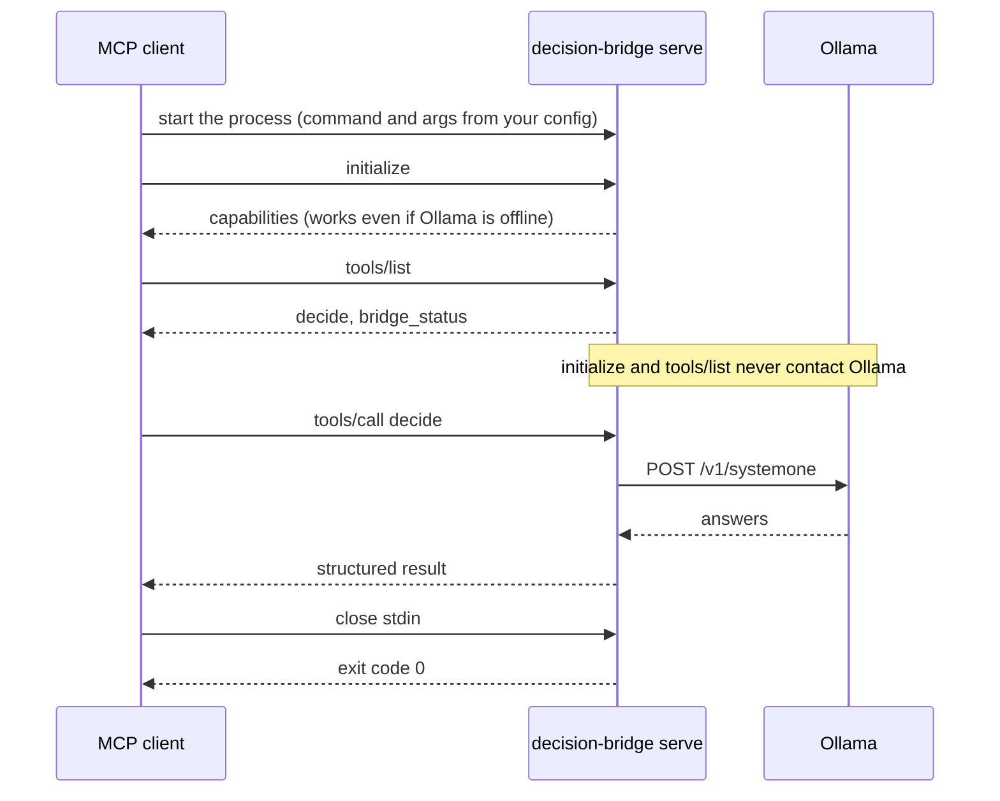

# Connecting an MCP client

An MCP client starts `decision-bridge serve`; the bridge connects to Ollama; Ollama runs Nimble. Ollama's API address is not an MCP server URL, and this project does not provide an HTTP/SSE MCP endpoint.

Find your executable's absolute path first ([installation](installation.md#finding-the-executable)) and run `decision-bridge doctor` before configuring a client. Nothing here is done for you: installing the package never edits client configuration.

## How the connection works



## Status

| Client | Status | Notes |
|---|---|---|
| Any stdio MCP client (official Python SDK client) | **Tested**: 2026-09-30, `mcp` SDK 2.2.0, macOS. Automated suite against a fake Ollama, plus a live run against a real Ollama and model | Initialization, `tools/list`, both tools, errors, cancellation, shutdown |
| Claude Code | **Registered; connection check passed**: 2026-09-30, Claude Code 2.1.285, macOS. `claude mcp list` and `claude mcp get` report `Connected` | No tool call from a live Claude Code session has been run |
| Codex CLI | **Registered; not connected end to end**: 2026-09-30, codex-cli 0.153.4, macOS. `codex mcp get` shows the server enabled (stdio) | No Codex session has been run against this server |
| Claude Desktop | **Documented, untested** | From the official MCP docs, 2026-09-30 |
| Cursor | **Documented, untested** | From Cursor's docs, 2026-09-30 |
| Antigravity | **Documented, untested** | From Google's codelabs and a community guide, 2026-09-30; not checked against a primary reference page |

"Untested" means the protocol is standard and should work, but nobody has run that client against this server. "Connection check passed" means the client's own health check launched the server and completed the MCP handshake, not that an agent used a tool. Report results if you try one.

## Generic stdio configuration

This is the *common* configuration shape, not a universal file format. Some clients use different root keys, fields, settings locations, or approval flows. Replace the path.

```json
{
  "mcpServers": {
    "decision-bridge": {
      "command": "/absolute/path/to/decision-bridge",
      "args": ["serve"],
      "env": {
        "DECISION_BRIDGE_OLLAMA_URL": "http://127.0.0.1:11434",
        "DECISION_BRIDGE_MODEL": "nimble:latest"
      }
    }
  }
}
```

On Windows, escape backslashes: `"command": "C:\\Users\\you\\.local\\bin\\decision-bridge.exe"`. The `env` block is optional when the defaults suit you.

## Codex

Current command shape (sources: [Codex MCP docs](https://developers.openai.com/codex/mcp), and `codex mcp add --help`):

```sh
codex mcp add decision-bridge -- /absolute/path/to/decision-bridge serve
codex mcp list
```

Optional environment values: `codex mcp add decision-bridge --env DECISION_BRIDGE_MODEL=nimble:latest -- /absolute/path/to/decision-bridge serve`. Inspect with `codex mcp get decision-bridge`; remove with `codex mcp remove decision-bridge`.

Equivalent `~/.codex/config.toml` entry:

```toml
[mcp_servers.decision-bridge]
command = "/absolute/path/to/decision-bridge"
args = ["serve"]

[mcp_servers.decision-bridge.env]
DECISION_BRIDGE_MODEL = "nimble:latest"
```

Codex documents that config changes require restarting the client; inside the Codex terminal UI, `/mcp` shows active servers.

## Claude Code

Register the server with the Claude Code CLI (syntax from `claude mcp add --help`, Claude Code 2.1.285):

```sh
claude mcp add -s user decision-bridge -- /absolute/path/to/decision-bridge serve
```

- `-s user` makes it available in all your projects. The default scope is `local` (the current project only); `-s project` writes a shared `.mcp.json` intended to be checked in, so use it only when your whole team should get the server.
- Verify: `claude mcp list` runs a health check, and `claude mcp get decision-bridge` shows the scope, command, and status. Inside a session, `/mcp` lists servers and their status.
- Pass configuration with `-e`: `claude mcp add -s user decision-bridge -e DECISION_BRIDGE_KEEP_ALIVE=30m -- /absolute/path/to/decision-bridge serve`.
- Remove: `claude mcp remove decision-bridge -s user`.
- Already-running sessions do not see newly added servers; start a new session (or reconnect with `/mcp`).

To make agents use it well, add the block from [agent-usage.md](agent-usage.md) to your `CLAUDE.md`.

## Claude Desktop

From the [official MCP guide](https://modelcontextprotocol.io/docs/develop/connect-local-servers): open the Claude menu, then Settings, then Developer, then Edit Config. The file is:

- macOS: `~/Library/Application Support/Claude/claude_desktop_config.json`
- Windows: `%APPDATA%\Claude\claude_desktop_config.json`

Add the generic block above under `mcpServers` (use an absolute path; desktop apps do not reliably inherit your shell `PATH`), save, then **fully quit and restart** Claude Desktop. MCP logs are in `~/Library/Logs/Claude` (macOS) or `%APPDATA%\Claude\logs` (Windows); `mcp-server-decision-bridge.log` holds the bridge's stderr.

## Cursor

From [Cursor's MCP docs](https://cursor.com/docs/context/mcp): put the generic block in `.cursor/mcp.json` (project) or `~/.cursor/mcp.json` (global). Cursor's documented fields for a stdio server are `command`, `args`, and `env` (plus an optional `envFile`). Servers can be toggled in Cursor's settings UI.

## Antigravity

Not verified here, and taken from secondary sources ([Google's Antigravity MCP codelab](https://codelabs.developers.google.com/google-workspace-mcp-antigravity?hl=en) and a [community configuration guide](https://medium.com/google-cloud/configuring-mcp-servers-and-skills-for-antigravity-cli-and-ide-a938c7eebb78)). They describe a single configuration file shared by the Antigravity IDE, CLI, and 2.0: `~/.gemini/config/mcp_config.json`, with the same `mcpServers` shape (`command`, `args`, `env`, and an optional `disabled`):

```json
{
  "mcpServers": {
    "decision-bridge": {
      "command": "/absolute/path/to/decision-bridge",
      "args": ["serve"]
    }
  }
}
```

If the file already has other servers, add only the `decision-bridge` entry inside `mcpServers`. Check Antigravity's own documentation if the location or fields differ in your version, and restart it after editing.

## Other clients

Any client that launches a stdio MCP server works with the generic block above: a `command` (absolute path) and `args: ["serve"]`. Key names and file locations vary by client.

## Verify

1. `decision-bridge doctor --smoke-test` in a terminal: it should end with `Result: ready`.
2. In the client, confirm the server shows two tools: `decide` and `bridge_status`.
3. Ask:

   > Use Decision Bridge to classify the supplied request into one of the provided categories. Return the selected category and probabilities. Do not execute the selected action.

If the tools do not appear, see [troubleshooting](troubleshooting.md). For how to use it day to day, see the [usage guide](usage.md); for how agents should use the tools, see [agent-usage.md](agent-usage.md).
