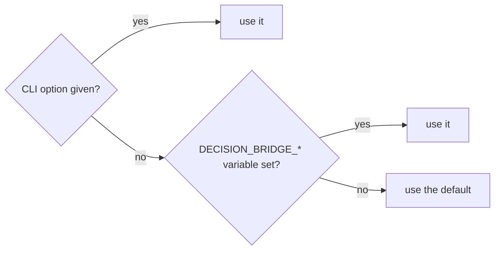
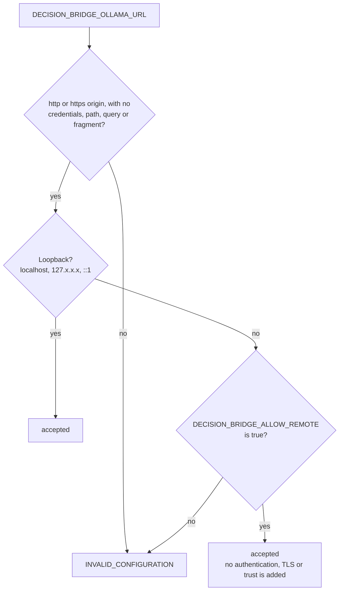

# Configuration

Precedence: explicit CLI option, then environment variable, then default. There is no implicit `.env` loading from the working directory. Values are validated at startup; a bad value exits with code 2 and `INVALID_CONFIGURATION`.

| Variable | CLI option | Default | Meaning |
|---|---|---|---|
| `DECISION_BRIDGE_OLLAMA_URL` | `--ollama-url` | `http://127.0.0.1:11434` | Operator-configured Ollama origin |
| `DECISION_BRIDGE_MODEL` | `--model` | `nimble:latest` | Installed model tag used for all decisions |
| `DECISION_BRIDGE_CONNECT_TIMEOUT_SECONDS` | `--connect-timeout` | `5` | Connection timeout |
| `DECISION_BRIDGE_REQUEST_TIMEOUT_SECONDS` | `--request-timeout` | `120` | Total decision deadline, including queue wait |
| `DECISION_BRIDGE_KEEP_ALIVE` | `--keep-alive` | unset | Sent upstream only when configured (for example `5m`, `1h30m`, `0`, `-1`) |
| `DECISION_BRIDGE_MAX_CONCURRENCY` | `--max-concurrency` | `1` | In-flight model calls per process (1-32) |
| `DECISION_BRIDGE_ALLOW_REMOTE` | `--allow-remote` | `false` | Permit a non-loopback Ollama origin |
| `DECISION_BRIDGE_LOG_LEVEL` | `--log-level` | `WARNING` | Metadata-only logs on stderr |

These are this project's defaults, not claims about upstream defaults.

## Endpoint rules

- The origin must be `http` or `https` with no credentials, query, fragment, or path prefix.
- Loopback is accepted by default: `localhost`, `127.0.0.0/8` addresses, and `[::1]`. Anything else is refused unless `DECISION_BRIDGE_ALLOW_REMOTE=true`.
- Remote mode is an operator decision. It does **not** provide authentication, TLS, or trust: the bridge sends the evidence to whatever server you configure, which controls what happens to it. Use a network you trust.
- Redirects are never followed, and `HTTP_PROXY`-style environment variables are ignored for the Ollama connection.
- MCP callers cannot set the URL, model, headers, timeouts, or remote policy; tool arguments containing unknown properties are rejected.

## Model rules

- Any locally installed Nimble tag can be selected (`DECISION_BRIDGE_MODEL`).
- Cloud selectors (a name ending in `-cloud` or `:cloud`) are rejected with `MODEL_NOT_LOCAL`, and so is a model that Ollama reports as served remotely. The default configuration never silently uses Ollama Cloud.
- Installed-model metadata (`GET /api/tags`) is read once per process and cached only when the model is confirmed usable; it is re-read by `doctor`/`bridge_status`, and after a model-not-found response.
- A model whose reported capabilities lack `decision` is refused with `DECISION_UNSUPPORTED`. If the server reports no capabilities, the request proceeds and the decision call itself decides.

## Concurrency and limits

- `max_concurrency` decisions run at once; up to 4 more may wait. A further call fails immediately with `BUSY`.
- One deadline (`REQUEST_TIMEOUT_SECONDS`) covers queue wait plus the model call. On expiry the bridge returns `TIMEOUT`; Ollama may keep computing after the connection closes. There is no automatic retry.
- Serialized request bodies over 64 KiB (65,536 UTF-8 bytes, counting the model name and questions) are rejected locally with `PAYLOAD_TOO_LARGE`. Token overflow is reported by Ollama as `CONTEXT_LIMIT`. Upstream responses over 1 MiB are rejected.
- `decision-bridge decide` reads at most 256 KiB of raw input.

## Logging

Logs go to stderr only, at `WARNING` by default, and contain metadata only: request ID, duration, question count, and stable error code. Evidence, questions, answers, and raw upstream error bodies are never logged, at any level. In CLI error cases the error JSON is the **last** stderr line; earlier lines may be log records.
