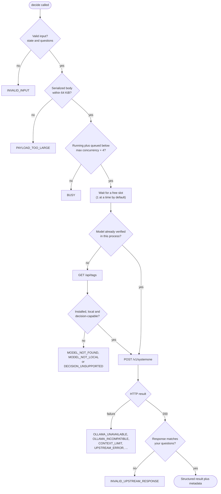
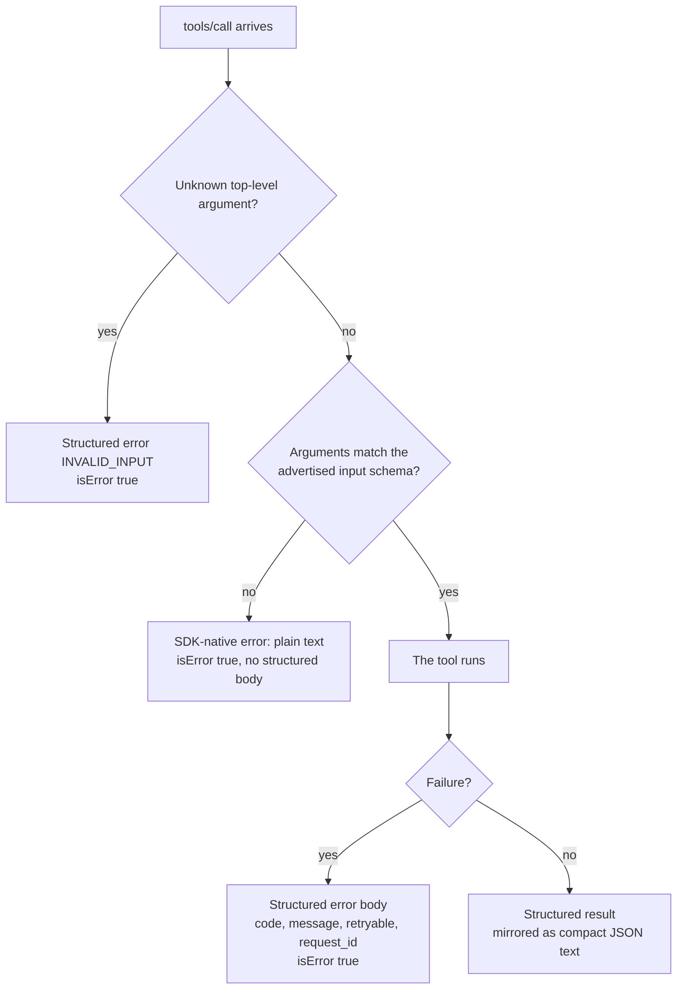

# MCP tool contract

The server speaks MCP over stdio (stdout carries protocol messages only; logs go to stderr) and exposes exactly two tools. It starts and initializes even when Ollama is offline. Upstream request/response contract: [Nimble on Ollama](https://ollama.com/library/nimble:latest).

## `decide`

Evaluate caller-supplied evidence against caller-supplied fixed questions using the configured local decision model. **Advisory only**: it does not authorize or execute anything.

Arguments (nothing else is accepted):

- `state`: a string, JSON object, or JSON array. A top-level number, boolean, or null is rejected; nested values may be normal JSON scalars; non-finite numbers and nesting deeper than 16 levels are rejected.
- `questions`: an insertion-ordered object of unique, non-empty question IDs to question objects. 1-64 questions.

Question types (`type`, plus a non-blank `instructions`):

| `type` | `criteria` | Answer fields |
|---|---|---|
| `choice` | object of label to description (or `null`), 2-26 labels | `choice`, `probabilities`, optional `confidence` |
| `noul` | optional `{"true": "...", "false": "..."}` | `noul` (a probability between 0 and 1, **not** a boolean), optional `confidence` |
| `score` | ordered array of level descriptions, lowest first, 2-26 levels | `score` (number from 0 to levels-1), `legend`, `probabilities`, optional `confidence` |

Unsupported properties are rejected rather than ignored. The model name, keep-alive, and endpoint come from operator configuration and are never accepted from the caller.

### How a request flows



One deadline covers the wait for a slot and the model call together; if it expires the result is `TIMEOUT`. If the model list cannot be read (for example a server that does not offer it), the request goes ahead and the decision call itself decides.

### Success

The result is returned as MCP structured content (with an output schema in `tools/list`) and mirrored as compact JSON text:

```json
{"schema_version": "1", "model": "...", "answers": {"<id>": {"type": "...", "...": "..."}},
 "usage": {"input_tokens": 0, "output_tokens": 0},
 "metadata": {"duration_ms": 0, "request_id": "..."}}
```

- `answers` follow your question order. Numbers are exactly what Ollama returned: never rounded or recalculated. `usage` is present only if Ollama supplied it.
- `duration_ms` is elapsed decision-service time (monotonic clock) including validation and queue wait.
- `schema_version` versions this envelope separately from the package version.
- The bridge validates every response against your questions: one answer per question with the matching type; choice labels and probability keys match what you submitted; numbers are finite and in range; probabilities sum to 1 within a tolerance of 0.001; scores stay within the rubric range with matching level keys. Anything else is `INVALID_UPSTREAM_RESPONSE`, never a partial or "repaired" success. Additive unknown upstream fields are ignored.
- `confidence` is passed through as reported. It reflects probability concentration, not calibrated correctness.

### Failure

Execution failures are MCP tool errors (`isError: true`) whose structured content and text are:

```json
{"error": {"code": "MODEL_NOT_FOUND", "message": "...", "retryable": false, "request_id": "..."}}
```

| Code | Meaning / recovery |
|---|---|
| `INVALID_INPUT` | Fix the question schema or state type (also: unknown arguments) |
| `PAYLOAD_TOO_LARGE` | Reduce the serialized request (limit 64 KiB) |
| `INVALID_CONFIGURATION` | Fix an environment variable or CLI option (CLI only; the server refuses to start) |
| `OLLAMA_UNAVAILABLE` | Start Ollama or check the endpoint |
| `OLLAMA_INCOMPATIBLE` | Upgrade to Ollama 0.35 or newer |
| `MODEL_NOT_FOUND` | Install the configured model explicitly (`ollama pull ...`) |
| `MODEL_NOT_LOCAL` | Select an installed local model |
| `DECISION_UNSUPPORTED` | The model does not report decision support |
| `CONTEXT_LIMIT` | Shorten the evidence or reduce the question set |
| `TIMEOUT` | Deadline expired; check load or raise the timeout |
| `BUSY` | Local capacity exceeded; try again shortly |
| `UPSTREAM_ERROR` | Ollama failed; details are deliberately not echoed |
| `INVALID_UPSTREAM_RESPONSE` | Ollama's response violated the contract |

`retryable` is advice to the caller; the bridge itself never retries inference.



**Two error layers.** Arguments that violate the advertised input schema (wrong types, out-of-range counts, an unknown question `type`) are rejected by the MCP SDK before the tool runs, as an `isError` result with a plain-text message and no structured `error` body. Unknown top-level arguments and all execution failures use the structured body above. Cancellation and disconnects abort queued and in-flight HTTP work; Ollama may continue computing after its connection closes.

## `bridge_status`

No arguments. Returns bounded diagnostics: bridge version, output schema version, configured model and endpoint, Ollama reachability and version, whether the configured model is installed/local/decision-capable, and `inference.state`:

- `not_checked`: no decision has run in this process yet
- `verified`: the most recent decision succeeded
- `failed`: the most recent decision failed for a service reason

States use `available`, `unavailable`, `unknown`, or `not_checked`. It performs only cheap checks: it never loads the model or runs inference, never lists other installed models, and never returns raw upstream errors, environment variables, or credentials. An unreachable Ollama is reported as data, not as a crash.

## Annotations

Both tools advertise `readOnlyHint: true`, `destructiveHint: false`, and `openWorldHint: false`. `idempotentHint` is deliberately not set: inference consumes CPU/GPU, may load a model into memory, and its output is not promised to repeat. Annotations describe the tools; they never replace validation or your client's permission controls.
